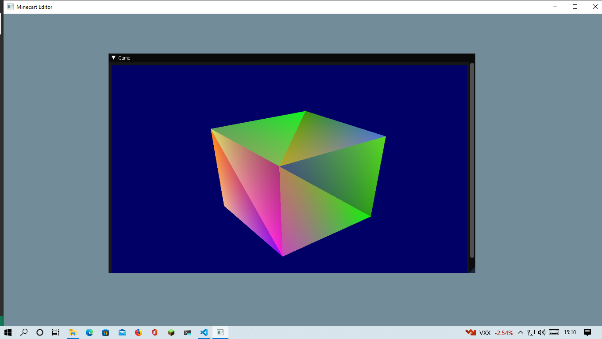

## Minecart

A miminal game engine using OpenGL 3.0 and ImGUI.
This is based of [https://github.com/Postrediori/MinimalImGui](https://github.com/Postrediori/MinimalImGui).



The project includes the following dependencies:

* [Dear ImGUI](https://github.com/ocornut/imgui) - Minimal GUI (on the docking branch!).
* [glfw](https://github.com/glfw/glfw) - Windowing and Input.
* [glad](https://github.com/Dav1dde/glad) - OpenGL Function Loader.
* [glm](https://github.com/g-truc/glm) - OpenGL Maths Library.
* [lodepng](https://github.com/lvandeve/lodepng) - PNG loading library.

## Environment Setup

### Debian-based Systems

The following instructions apply to:

* Ubuntu 20.04, 18.04, 16.04
* Debian 10, 9

```
sudo apt-get install -y \
    build-essential \
    cmake \
    xorg-dev \
    libgl1-mesa-dev \
    libfreetype6-dev
```

### RedHat-based Systems

The following instructions apply to:

* Fedora 22 and higher

```
sudo dnf install -y \
    gcc gcc-c++ make \
    cmake \
    mesa-libGL-devel \
    libXrandr-devel \
    libXinerama-devel \
    libXcursor-devel \
    libXi-devel \
    freetype-devel
```

### MSYS2 (Windows) and maybe other systems which uses Pacman

* x86_64 based systems
```
pacman -S base-devel mingw-w64-x86_64-{cmake,gcc,freeglut,glew,libpng,mesa}
```
* other systems
Replace `mingw-w64-x86_64` with the architecture for your system (e.g. `mingw-w64-clang-i686`)

## Building

Check out sources with `--recursive` parameter for 3rd-party libraries:

```
git clone --recursive https://github.com/ajh123-development/Minecart.git
```

Prepare build with CMake and build executables

```
mkdir build && cd build
cmake .. -DCMAKE_BUILD_TYPE=Release
make
```
In somecases, `make` has to be replaced with `ninja`.

## Running

Using `make install` will copy the executable to `bundle` directory:

```
cd bundle

# Example with OpenGL 2.0:
./bundle/MinimalImGuiOpenGl2

# Example with OpenGL 3.0:
./bundle/MinimalImGuiOpenGl3
```

## TODO
* Game Objects.
  * Textures.
  * Camera.
  * Others.
* Scenes.
* An actual editor.
* Multiplayer support.
* Autogeneration of ImGui headers using [cimgui](https://github.com/cimgui/cimgui)?
